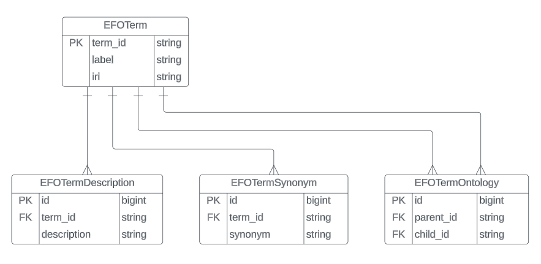

# EFO Term data backend infrastructure

## Stack

- **Backend**: Django
- **Database**: PostgreSQL


# Setup

To set up and run the project in a new development environment, follow these steps:

1. **Run a PostgreSQL server and create a database called** <br> ```ols```
2. **Clone the git repository** 
3. **Navigate to the project directory:** <br>```cd incelligencia_backend```
4. **Install the dependencies:**<br>```pip install -r requirements.txt```
5. **Create database migrations** 
   1. ```python3 manage.py makemigrations ols_app```
   2. ```python3 manage.py migrate``` 
6. **Run the application**: <br> ```python3 manage.py runserver```
7. **The application starts at** <br>`http://localhost:8000`


# Database Schema 
**The database ERD**: 


The term_id on the EFOTerm Table is a representation of the obo_id (string) found in the OLS API. <br> The database schema is defined in the models.py file in the ols_app directory.

# APIs 

1. **You can find the documentation of the APIs by visiting either:** <br>
```http://localhost:8000/swagger/``` or ```http://localhost:8000/redoc/``` <br>
2. **There are 2 django apps**:
   1. ols_app: <br> Entities CRUD operations <br> You can access the endpoints on ```http://localhost:8000/api/```
   2. ols_app_table: <br> Endpoints used by the front-end table application  <br> You can find the endpoints ```http://localhost:8000/api/table/```


# Testing
1. **For testing purposes, the project employs Pytest, Factory boy, and Faker.**
2. **To run the tests, execute the following command:** ```pytest -rP```

# Data insertion
1. **You can locate a Python script named "persist_database.py," which facilitates data insertion operations from the OLS API.**
2. **You can run the script:** <br>```python3 persist_database.py```
3. **The algorithm utilized by this script is a Depth-First Search (DFS) commencing from the root node of the EFO Term graph, which is accessible via the following URL** <br> ```https://www.ebi.ac.uk/ols/api/ontologies/efo/terms/http%253A%252F%252Fpurl.obolibrary.org%252Fobo%252FIAO_0000030/parents```
4. **It's essential to note that having 40000+ terms within the EFO Term graph,  the process of inserting all these terms might be time-consuming.** <br> If necessary, you have the option to terminate the process at any point by using the keyboard shortcut: ```Ctrl + C``` 